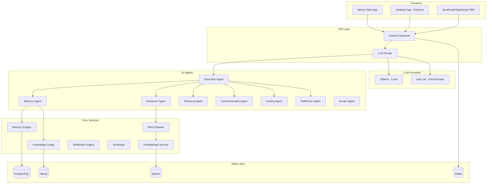

<!-- SynapseOS Banner Placeholder -->
<p align="center">
  
</p>

<h1 align="center">SynapseOS</h1>

<p align="center">
  <strong>A Privacy-First AI Operating System — Your Persistent Digital Intelligence</strong>
</p>

<p align="center">
  <a href="#features">Features</a> •
  <a href="#tech-stack">Tech Stack</a> •
  <a href="#architecture">Architecture</a> •
  <a href="#getting-started">Getting Started</a> •
  <a href="#contributing">Contributing</a> •
  <a href="#license">License</a>
</p>

---

## About

SynapseOS is a privacy-first AI Operating System that acts as a user's persistent digital intelligence. It combines long-term memory, knowledge graphs, vector search, multi-agent AI, retrieval-augmented generation, and local/cloud LLM routing into a unified, self-evolving platform.

Everything runs locally by default. Your data never leaves your machine unless you choose to connect cloud providers.

## Features

- **Long-Term Memory** — Persistent, searchable memory that evolves with you
- **Knowledge Graphs** — Structured relationship mapping across all your data
- **Vector Search** — Semantic search powered by local embeddings
- **Multi-Agent AI** — Specialized AI agents for different cognitive tasks
- **RAG Pipeline** — Retrieval-augmented generation for accurate, grounded responses
- **Local + Cloud LLM Routing** — Seamlessly route between local (Ollama) and cloud models
- **Self-Evolving Memory** — Memory that organizes, compresses, and optimizes itself
- **Desktop Application** — Native desktop experience with real-time graph visualization
- **SDK** — Programmatic access to all SynapseOS capabilities
- **Privacy-First** — All data stored locally by default, full encryption at rest

## Tech Stack

| Layer | Technology |
|-------|-----------|
| Frontend | Next.js, TypeScript, Tailwind CSS, shadcn/ui, Framer Motion, React Flow, Zustand, TanStack Query |
| Backend | FastAPI, Python 3.12, Pydantic, SQLAlchemy, Alembic |
| Databases | PostgreSQL, Qdrant (Vectors), Neo4j (Graphs), Redis (Cache) |
| AI Stack | LangGraph, PydanticAI, LiteLLM, DSPy, MCP, Ollama |
| Infrastructure | Docker, Docker Compose, GitHub Actions |
| Desktop | Electron (planned) |

## Architecture



## Folder Structure

```
synapseos/
├── apps/
│   ├── web/                  # Next.js frontend application
│   ├── api/                  # FastAPI backend application
│   └── desktop/              # Electron desktop application
├── packages/
│   ├── ui/                   # Shared UI components (shadcn/ui)
│   ├── config/               # Shared configurations (ESLint, Prettier, TypeScript)
│   ├── types/                # Shared TypeScript/Python type definitions
│   ├── sdk/                  # JavaScript/TypeScript SDK
│   └── shared/               # Shared utilities and constants
├── services/
│   ├── memory-engine/        # Long-term memory management
│   ├── agent-runtime/        # Multi-agent orchestration
│   ├── rag/                  # Retrieval-augmented generation pipeline
│   ├── reflection/           # Self-reflection and memory optimization
│   ├── embeddings/           # Embedding generation and management
│   ├── llm-router/           # Local/cloud LLM routing
│   ├── connectors/           # External data connectors
│   └── scheduler/            # Background task scheduling
├── infrastructure/
│   ├── docker/               # Docker configurations
│   ├── nginx/                # Nginx reverse proxy
│   ├── monitoring/           # Prometheus, Grafana configs
│   └── scripts/              # Deployment and utility scripts
├── docs/
│   ├── architecture/         # System architecture documentation
│   ├── research/             # Research papers and notes
│   ├── api/                  # API documentation
│   ├── roadmap/              # Development roadmap
│   └── diagrams/             # Architecture diagrams
├── tests/
│   ├── unit/                 # Unit tests
│   ├── integration/          # Integration tests
│   └── e2e/                  # End-to-end tests
└── examples/                 # Usage examples and demos
```

## Development Status

> **Stage: Architecture & Scaffolding**
>
> This project is in its initial architecture phase. The repository contains project structure, configuration, and documentation. Business logic implementation is planned for upcoming sprints.

| Component | Status |
|-----------|--------|
| Project Architecture | ✅ Complete |
| Documentation | 🔄 In Progress |
| Frontend UI | ⏳ Planned |
| Backend API | ⏳ Planned |
| Memory Engine | ⏳ Planned |
| Agent System | ⏳ Planned |
| RAG Pipeline | ⏳ Planned |
| Knowledge Graph | ⏳ Planned |
| Desktop App | ⏳ Planned |
| SDK | ⏳ Planned |
| Docker Setup | 🔄 In Progress |

## Roadmap

See [ROADMAP.md](ROADMAP.md) for the detailed development roadmap.

**Phase 1 — Foundation** (Current)
- [x] Project architecture design
- [x] Monorepo scaffolding
- [x] Docker infrastructure
- [ ] Core API endpoints
- [ ] Database schemas & migrations

**Phase 2 — Memory & Knowledge**
- [ ] Memory Engine implementation
- [ ] Knowledge Graph integration
- [ ] Embeddings pipeline
- [ ] Vector search

**Phase 3 — Intelligence**
- [ ] Agent Runtime framework
- [ ] RAG Pipeline
- [ ] LLM Router
- [ ] Reflection Engine

**Phase 4 — Interface**
- [ ] Dashboard UI
- [ ] Memory visualization
- [ ] Graph explorer
- [ ] Real-time streaming

**Phase 5 — Polish & Scale**
- [ ] Desktop application
- [ ] SDK release
- [ ] Performance optimization
- [ ] Comprehensive testing

## Getting Started

### Prerequisites

- Docker & Docker Compose
- Node.js 20+ (for frontend development)
- Python 3.12+ (for backend development)

### Docker Setup (Recommended)

```bash
# Clone the repository
git clone https://github.com/synapseos/synapseos.git
cd synapseos

# Copy environment variables
cp .env.example .env

# Start all services
docker compose up -d

# Access the application
# Web UI:    http://localhost:3000
# API:       http://localhost:8000/docs
# Neo4j:     http://localhost:7474
# Qdrant:    http://localhost:6333
# Grafana:   http://localhost:3001
```

### Local Development

```bash
# Frontend
cd apps/web
npm install
npm run dev

# Backend
cd apps/api
python -m venv .venv
source .venv/bin/activate  # Windows: .venv\Scripts\activate
pip install -r requirements.txt
uvicorn app.main:app --reload
```

## Contributing

We welcome contributions! Please read our [Contributing Guide](CONTRIBUTING.md) before submitting a PR.

See also our [Code of Conduct](CODE_OF_CONDUCT.md) and [Security Policy](SECURITY.md).

## License

SynapseOS is licensed under the **Apache License 2.0** — see [LICENSE](LICENSE) for details.

## Research Vision

SynapseOS draws inspiration from:

- **Cognitive Architecture** — How human memory systems work (sensory, working, long-term)
- **Graph Neural Networks** — Relationship-aware intelligence
- **Memory-Augmented Neural Networks** — Learning to store and retrieve
- **Active Inference** — Self-organizing systems that minimize surprise

Our research direction aims to create an AI system that doesn't just respond, but **understands, remembers, and evolves** alongside its user.

## Screenshots

> Screenshots will be added as the UI develops.

| Dashboard | Memory Graph | Agent Chat |
|-----------|-------------|------------|
|  |  |  |

## Future Work

- Multi-user support with isolated memory spaces
- Plugin system for custom agents and connectors
- Voice interface integration
- Mobile companion app
- Federated learning across SynapseOS instances
- Marketplace for sharing agent configurations
- WebAssembly-based browser extension

---

<p align="center">
  Built with care by the SynapseOS community
</p>
