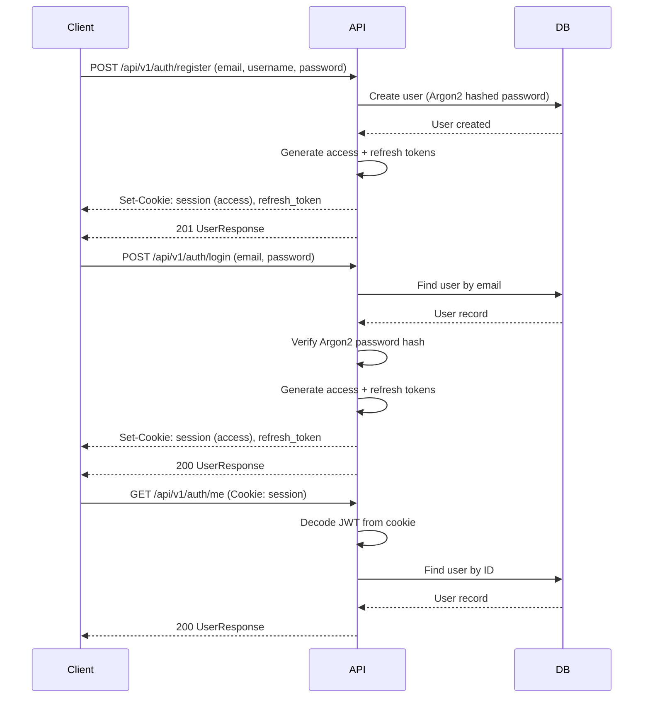

# Authentication Architecture

## Overview

SynapseOS uses JWT-based authentication with HTTP-only cookies for secure session management.

## Authentication Flow



## Token Configuration

| Token | Lifetime | Storage | Purpose |
|-------|----------|---------|---------|
| Access Token | 30 minutes | HTTP-only cookie | API authentication |
| Refresh Token | 7 days | HTTP-only cookie | Token renewal |

## Security Features

- **Argon2** password hashing (preferred over bcrypt)
- **HTTP-only cookies** — tokens inaccessible to JavaScript
- **Secure flag** — cookies only sent over HTTPS in production
- **SameSite=Lax** — CSRF protection
- **Environment-based secrets** — JWT signing key from env vars

## API Endpoints

| Method | Path | Description |
|--------|------|-------------|
| POST | `/api/v1/auth/register` | Register new user |
| POST | `/api/v1/auth/login` | Authenticate user |
| POST | `/api/v1/auth/logout` | Clear session |
| POST | `/api/v1/auth/refresh-token` | Refresh access token |
| GET | `/api/v1/auth/me` | Get current user |

## Backend Architecture

```
routers/v1/auth.py     → Route handlers (HTTP layer)
services/auth.py       → Business logic (auth flows)
repositories/user.py   → Data access (User CRUD)
core/security.py       → JWT + password utilities
core/exceptions.py     → Error handling
schemas/auth.py        → Request/response validation
models/user.py         → SQLAlchemy model
```
