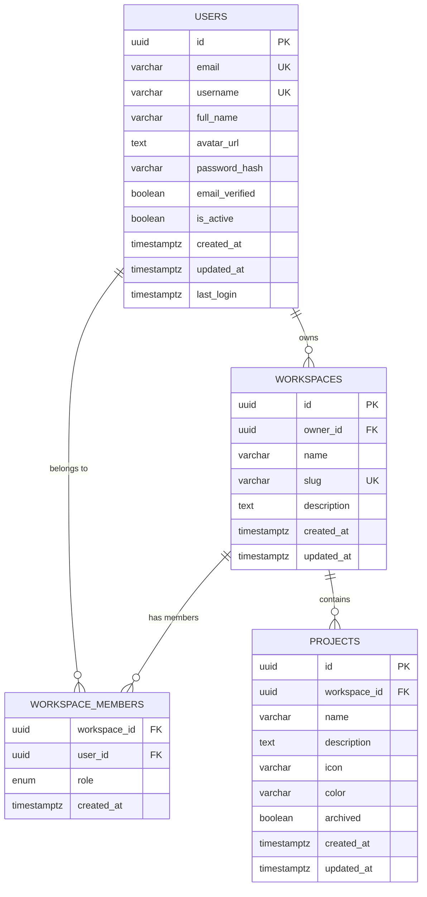

# Identity Data Model

## Entity-Relationship Diagram



## Relationships

| Relationship | Type | Description |
|-------------|------|-------------|
| User → Workspace | One-to-Many | A user owns multiple workspaces |
| User → WorkspaceMember | One-to-Many | A user can belong to multiple workspaces |
| Workspace → WorkspaceMember | One-to-Many | A workspace has multiple members |
| Workspace → Project | One-to-Many | A workspace contains multiple projects |

## Ownership Hierarchy

```
User (owner)
  └── Workspace
        ├── WorkspaceMember (owner, admin, member)
        └── Project
              └── [Future: Memory, Agent, Connector]
```

## Roles

| Role | Permissions |
|------|------------|
| `owner` | Full control. Can delete workspace, manage all members |
| `admin` | Can update workspace, manage members |
| `member` | Can view and create projects |

## Indexes

| Table | Index | Type |
|-------|-------|------|
| users | email | Unique |
| users | username | Unique |
| workspaces | slug | Unique |
| workspaces | owner_id | Foreign key |
| workspace_members | (workspace_id, user_id) | Composite primary key |
| projects | workspace_id | Foreign key |
